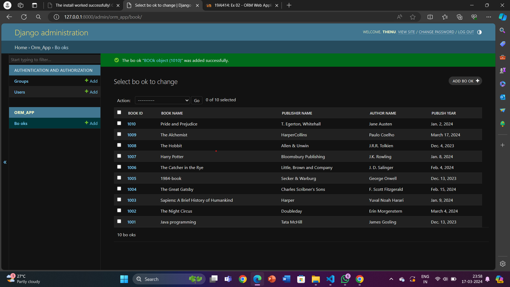

# Ex02 Django ORM Web Application
## Date: 17-03-24

## AIM
To develop a Django application to store and retrieve data from a Book database using Object Relational Mapping(ORM).

## Entity Relationship Diagram

Include your ER diagram here

## DESIGN STEPS

### STEP 1:
Clone the problem from GitHub

### STEP 2:
Create a new app in Django project

### STEP 3:
Enter the code for admin.py and models.py

### STEP 4:
Execute Django admin and create details for 10 books

## PROGRAM
```
Models.py
from django.db import models
from django.contrib import admin
# Create your models here.
class BOOk(models.Model):
    book_id=models.IntegerField(primary_key=True)
    book_name=models.CharField(max_length=50)
    publisher_name=models.CharField(max_length=50)
    author_name=models.CharField(max_length=50)
    publish_year=models.DateField()

class BookAdmin(admin.ModelAdmin):
    list_display=('book_id','book_name','publisher_name','author_name','publish_year')  
```    
Include your code here
```
Admin.py
from django.contrib import admin
from .models import BOOk,BookAdmin
# Register your models here.

admin.site.register(BOOk,BookAdmin)
```
## OUTPUT


Include the screenshot of your admin page.


## RESULT
Thus the program for creating a database using ORM hass been executed successfully
